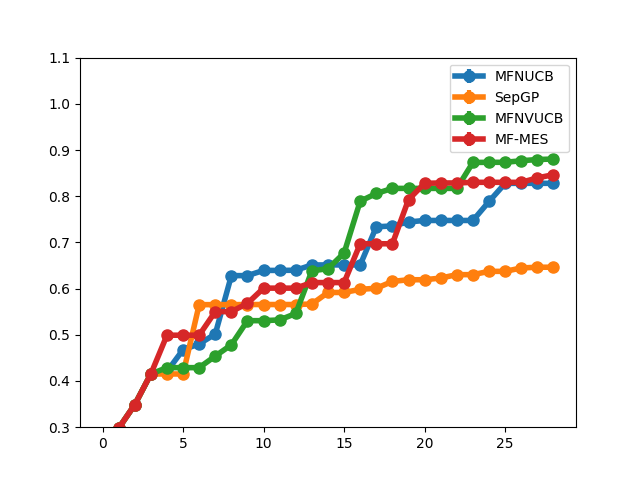

# Objective function and approximation model
Here we show a new toy example that we consider a more complicated evaluation-truth relationship that the ground truth function is:
$$f(x) = -(x^2 - 1)\cos(3\pi x), x \in [-1, 1];$$
the two approximation models are deterministic:
$$f^1(x) = f(x) + 0.5(x + 1) \sin(32\pi x), x \in [-1, 1];$$
$$f^2(x) = f(x) - 0.5(x - 1) \sin(32\pi x), x \in [-1, 1];$$

  

We consider maximizing the ground truth function which has one global maximum among three local maximums in this example.
# Surrogate model
To show the effectiveness of the surrogat modelling, we uniformly random select 50 samples for each approximation model so there are 100 samples in total.
The samples are illustrated as:

  

The predictive mean of the surrogate models with these 100 samples are illustrated as:

  

Here "GP with learnt noise" is the proposed GP with learnable noise, where the functional form of noise function is set to be linear while "GP(1)" and "GP(2)" are GPs fitting approximation model 1 and 2 respectively. The mean function all of the three GPs are set to be 0 and covariance matrix are all square exponential kernel whose the lengthscal is set to be 0.25. We also plotted the average value of "GP(1)" and "GP(2)" as "GP(average)". We can observe that though "GP(1)" and "GP(2)" are able to correctly identify three peaks, they fail to identify the global maximim (the middel peak) to be the largetst against the two local maximim while "GP with learnt noise" can.

# BO performance
To further illustrate the effectiveness of iMFBO, we show the BO performances as in the main text.
We perform 10 indepedent runs initialized with 4 random sample, in which 2 samples are used to query approximation model 1 and 2 are used to query approximation model 2. We illustrated the best queried objective function in one run that iMFBO guided by MFNVUCB successfully hit the global optimal while the other methods stuck in local maximum.

  

The results averaged over 10 indepedent runs is illustrated as follows:

  

